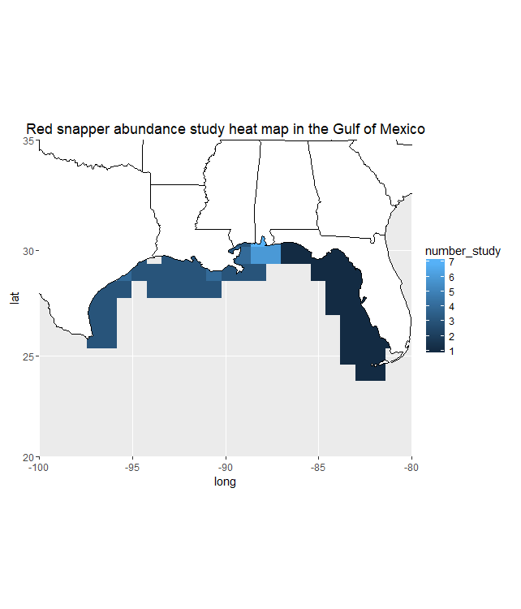

   
```{r setup, include=FALSE}
knitr::opts_chunk$set(echo = TRUE)
```

```{r library setup, include=FALSE,results="hide"}
library(plotrix) #for quick s.e. calculations sometimes needed for data tidy step
library(meta) #nice package for most meta-statistics
library(DT)
library(tidyverse)
library(PRISMAstatement)
library(knitr)
source('Meta-analysis/read_ris.R')

```
<br><br>

#### Load lit search CSVs.
```{r Import Data, message=FALSE}
WebOfSci1 <- read_csv("csvs/WebOfSci_GulfOfMexico_RedSnapper_Distribution.csv")
WebOfSci1$source <-'wb1' # add a ref code so you know where these titles came from
WebOfSci2 <- read_csv("csvs/WebOfSci_GulfOfMexico_RedSnapper_Dynamic.csv")
WebOfSci2$source <-'wb2'
WebOfSci3 <- read_csv("csvs/WebOfSci_GulfOfMexico_RedSnapper_Habitat.csv")
WebOfSci3$source <-'wb3'

Ebsco1 <- read_csv("csvs/Ebsco_GulfOfMexico_RedSnapper_Distribution.csv")
Ebsco1$source <-'eb1'
Ebsco2 <- read_csv("csvs/Ebsco_GulfOfMexico_RedSnapper_Dynamic.csv")
Ebsco2$source <-'eb2'
Ebsco3 <- read_csv("csvs/Ebsco_GulfOfMexico_RedSnapper_Habitat.csv")
Ebsco3$source <-'eb3'

GoogleScholar1 <-read_ris("csvs/GS_GulfOfMexico_RedSnapper_Distribution.RIS",50)
GoogleScholar1$source <-'gs1'
GoogleScholar2 <-read_ris("csvs/GS_GulfOfMexico_RedSnapper_Dynamic.RIS",50)
GoogleScholar2$source <-'gs2'
GoogleScholar3 <-read_ris("csvs/GS_GulfOfMexico_RedSnapper_Habitat.RIS",50)
GoogleScholar3$source <-'gs3'

# put all titles into one list
titleList <- rbind(WebOfSci1[c('Title','Authors','source')],
                   WebOfSci2[c('Title','Authors','source')],
                   WebOfSci3[c('Title','Authors','source')],
                   Ebsco1[c('Title','Authors','source')],
                   Ebsco2[c('Title','Authors','source')],
                   Ebsco3[c('Title','Authors','source')],
                   GoogleScholar1[c('Title','Authors','source')],
                   GoogleScholar2[c('Title','Authors','source')],
                   GoogleScholar3[c('Title','Authors','source')])
```

```{r wrangle for title matching}
# make titles all lowercase for matching
titleList$Title_lowercase <- str_to_lower(titleList$Title, locale = 'en')

# comon case of mismatch is 'u.s.' vs. 'us', so convert all 'u.s.' into 'us' for matching
titleList$Title_lowercase <-gsub('u\\.s\\.','us',titleList$Title_lowercase) 
# Remove trailing periods
titleList$Title_lowercase <-gsub('\\.$','',titleList$Title_lowercase) 
# Remove anything with NA author:
titleList <- titleList[!is.na(titleList$Authors),]

# get subset of unique titles
uniqueTitles <- titleList[!duplicated(titleList$Title_lowercase),]
write.csv(uniqueTitles, file = 'csvs/CombinedTitles.csv')

cat(paste0(length(titleList$Title), ' papers found, ', length(uniqueTitles$Title), ' unique titles.'))
```

```{r}
# To Do: Flag irrelevent titles based on a list of previously assessed titles.


```

```{r Search Terms, warning=FALSE, message=FALSE}
searchTerms <- read_csv("search_terms.csv")
kable(searchTerms, align = 'cll')

```

<br><br>

#### Meta-analysis workflow

```{r Prisma, fig.keep='all',warning=FALSE, message=FALSE, fig.width=5, echo=FALSE}
prisma(found = 118,
       found_other = 11,
       no_dupes = 113, 
       screened = 113, 
       screen_exclusions = 87, 
       full_text = 26,
       full_text_exclusions = 14, 
       qualitative = 12, 
       quantitative = 12,
       width = 600, height = 600)
```


<br><br>

##### Reasons for paper eliminations

```{r Table of paper exclusions, echo=FALSE, message = FALSE}
paperReasons <- read_csv("paper_reasons.csv")
# datatable(paperReasons)
```


```{r Plot Exclusions,fig.keep='all',warning=FALSE, message=FALSE}
ggplot(paperReasons, aes(Reason, Papers)) + geom_bar(stat = "identity", fill="blue") + coord_flip() + theme_grey(base_size = 18)

```


```{r import metadata, echo=FALSE, warning=FALSE, message= FALSE}
data <- read_csv("meta-analysis_data.csv")
# datatable(data)

```

<br><br>

#### A range of drivers were investigated:

```{r plot by driver, results="hide"}

data.simple <- data %>% group_by(Driver) %>% count()
ggplot(na.omit(data.simple), aes(Driver, n)) + 
  geom_bar(stat = "identity", fill = "blue") + 
  coord_flip()+ theme_grey(base_size = 18)

```
<br><br>

Three main study types were represented:


```{r plot by study type}
data.simple <- data %>% group_by(StudyType) %>% count()
ggplot(na.omit(data.simple), aes(StudyType, n)) + 
  geom_bar(stat = "identity", fill = "blue") + 
  theme_grey(base_size = 18) + 
  coord_flip()

```
<br><br>
<br><br>
#### Age classes and definitions varied: 

```{r plot by age class, results="hide"}

data$Age_class[grep('juvenile',data$Age_class)] <- 'Juvenile'
data.simple <- data %>% group_by(Age_class) %>% count()

ggplot(na.omit(data.simple), aes(Age_class, n)) + 
  geom_bar(stat = "identity", fill = "blue") + 
  theme_grey(base_size = 18) +
  coord_flip()

```
<br><br>

#### Effect sizes

```{r Estimate effect size by driver, results="hide", echo = FALSE}
treedata <- data %>% group_by(Driver) %>% summarise(mean.EffectSize_d = mean(EffectSize_d),
                                                    error = std.error(EffectSize_d))
```

```{r, Forest plot}
m <- metagen(mean.EffectSize_d, error, studlab = Driver, data = treedata) #fit generic meta-analysis to an object

#viz (draw a standard forest plot or metaregression plot)
forest(m,leftcols = "Driver",rightcols = c("effect", "ci"), fontsize=12) #grid-based graphics so a bit of work to resize
```

 

[Next Topic](https://nceas.github.io/oss-fishteam/R_code/Wrangle_Markdown.html)
