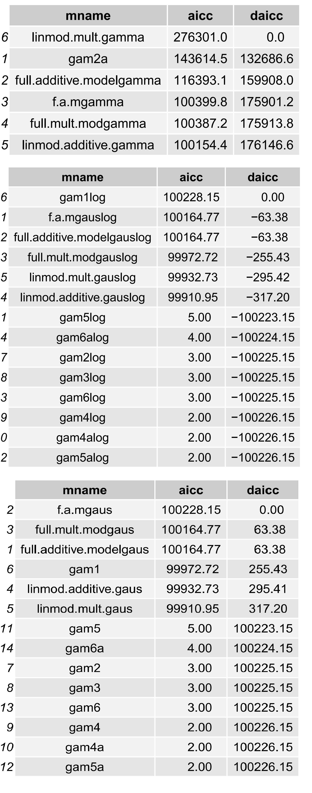
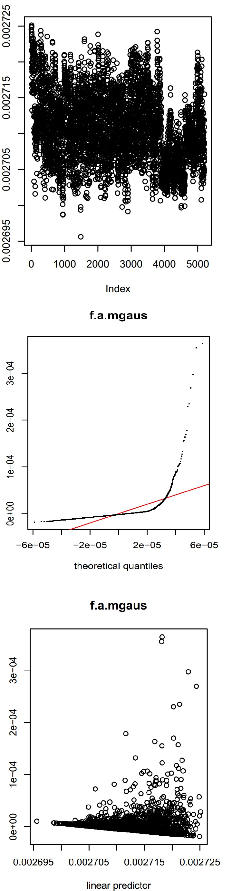
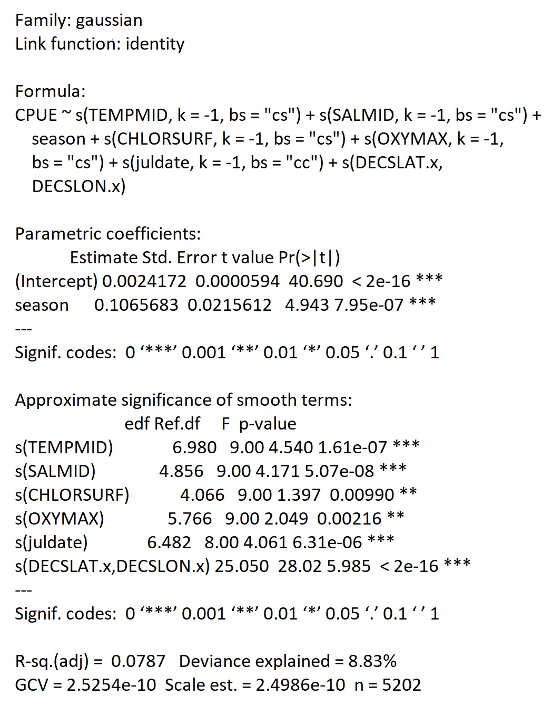
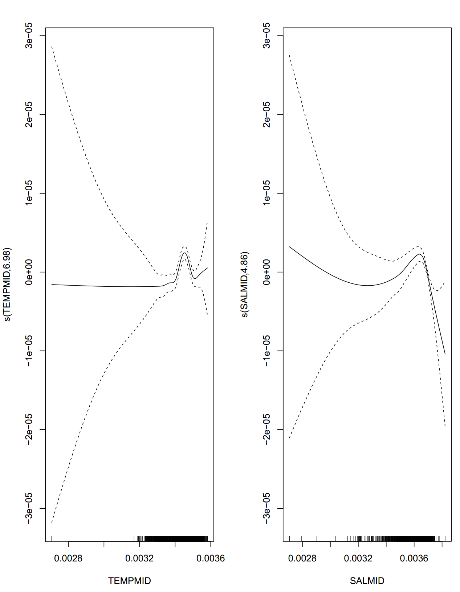
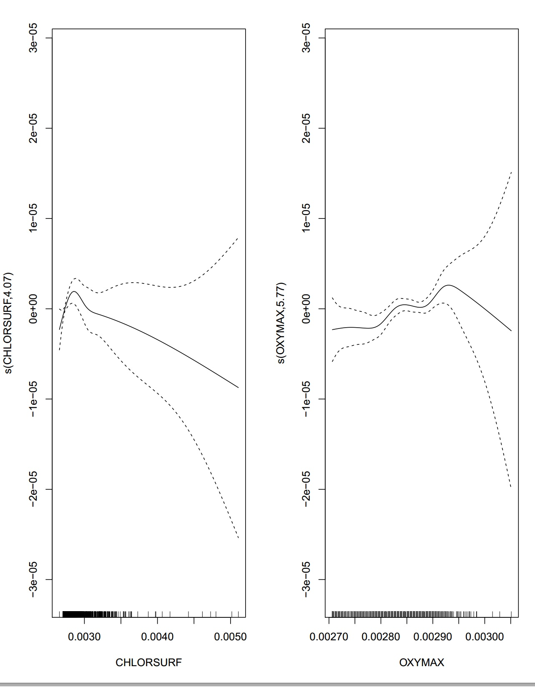
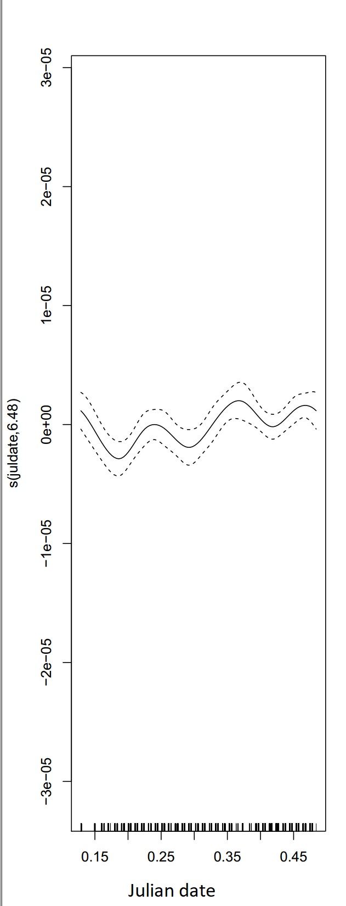
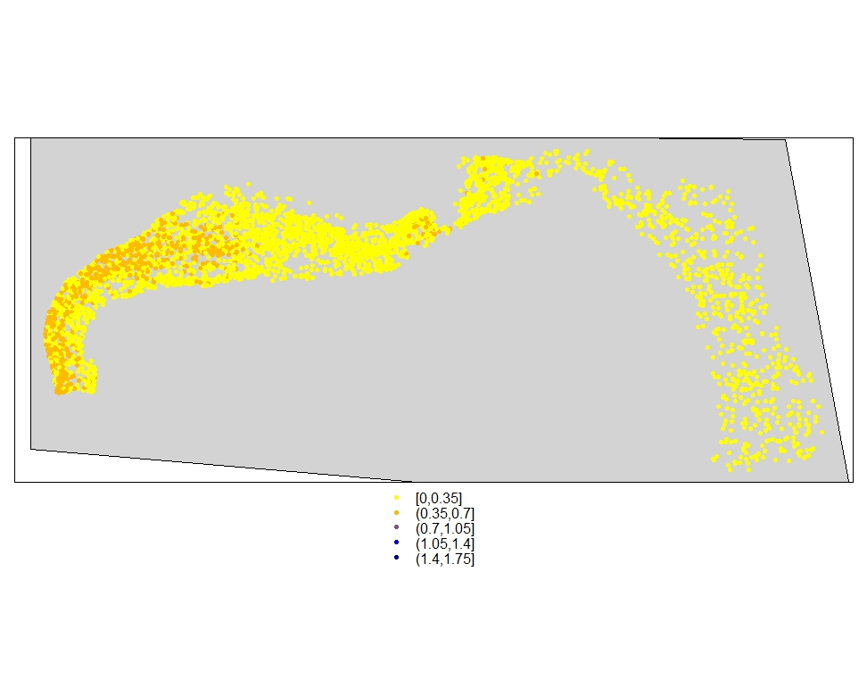
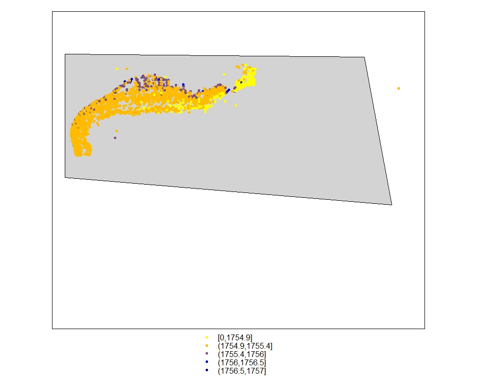
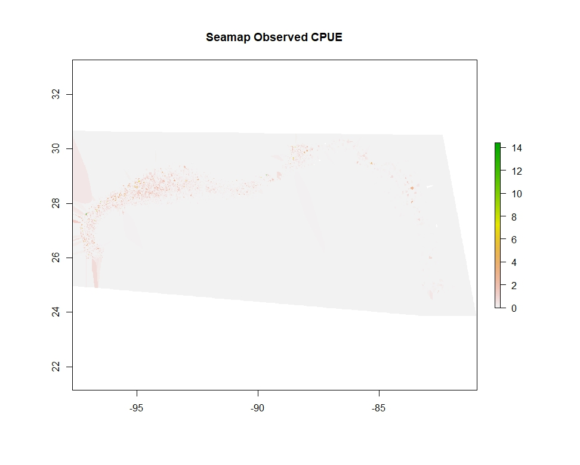
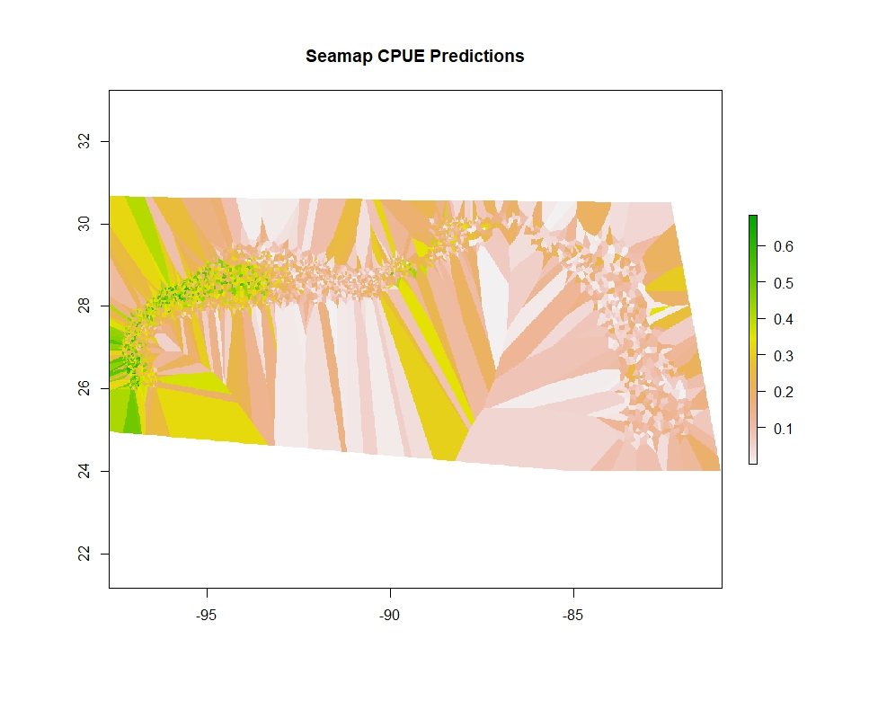

```{r setup, include=FALSE}
knitr::opts_chunk$set(echo = TRUE)
```

## Do environmental factors drive fish distribution?

###During the fish surveys where red snapper was collected, environmental variables were collected as well. Simultaneous collection of fish and environmental variable makes SEAMAP an excellent dataset to investigate which environmental variables are drivers of fish abundance and distribution. Based on the meta-analysis and available data, temperature, salinity, dissolved oxygen, and Chlorophyll a were chosen in the analyses. First a very similar data wrangling process as just presented for red snapper CPUE. 


##Are there significant correlations between fish abundance and environmental drivers?

###Next use GAMS (General Additive Models) to determine significance of environmental variables (drivers) to Red Snapper abundance and distribution, and determine what the predicted Red Snapper abundance and distribution would be based on the drivers.

###We transformed the data in two ways:
###Normalized and log-transformed 


###We first run the GAM models, and then proceed with model selection. 34 distinct models were analyzed, ranging from Gaussian, Gamma, and Poisson distributions, and a range of predictor combinations from full-predictor models to single-predictor models. Most models included a time and space predictor.

```{r, eval=FALSE}

dataonlynorm<-(dataonlys1-min(dataonlys1,na.rm=TRUE))/(max(dataonlys1,na.rm=TRUE)-min(dataonlys1,na.rm=TRUE))

#normalized models data

full.additive.modelpois<-gam(CPUE~TEMPMID+SALMID+CHLORSURF+OXYMAX+season+s(juldate,k=-1,bs="cc")+s(DECSLAT.x,DECSLON.x),data=dataonlynorm,family="poisson")
f.a.mpois<-gam(CPUE~s(TEMPMID,k=-1,bs="cs")+s(SALMID,k=-1,bs="cs")+season+s(CHLORSURF,k=-1,bs="cs")+s(OXYMAX,k=-1,bs="cs")+s(juldate,k=-1,bs="cc")+s(DECSLAT.x,DECSLON.x),data=dataonlynorm,family="poisson")
full.additive.modelgaus<-gam(CPUE~TEMPMID+SALMID+CHLORSURF+season+OXYMAX+s(juldate,k=-1,bs="cc")+s(DECSLAT.x,DECSLON.x),data=dataonlynorm,family="gaussian")

f.a.mgaus<-gam(CPUE~s(TEMPMID,k=-1,bs="cs")+s(SALMID,k=-1,bs="cs")+season+s(CHLORSURF,k=-1,bs="cs")+s(OXYMAX,k=-1,bs="cs")+s(juldate,k=-1,bs="cc")+s(DECSLAT.x,DECSLON.x),data=dataonlynorm,family="gaussian")

...


## Model comparison
##AIC and plot residuals
##Gamma model comparison, all normalized only
aicgamma<-data.frame(c(gam2a$aic,full.additive.modelgamma$aic,f.a.mgamma$aic,full.mult.modgamma$aic,linmod.additive.gamma$aic,linmod.mult.gamma$aic))
colnames(aicgamma)[1]<-"aic"
aicgamma$mname<-c(deparse(substitute(gam2a)),deparse(substitute(full.additive.modelgamma)),deparse(substitute(f.a.mgamma)),deparse(substitute(full.mult.modgamma)),deparse(substitute(linmod.additive.gamma)),deparse(substitute(linmod.mult.gamma)))
aicgamma$aicabs<-abs(aicgamma$aic)
aicgamma$aicc<-indepmod[1:6]
aicgamma$daicc<-indepmod[1:6]
indepmodgamma<-c(2,6,6,6,4,4)
for (i in 1:6){
  K<-indepmodgamma[i]
  n<-21208
  aicgamma$aicc[i]<-aicgamma$aic[i]+2*K*(K+1)/(n-K-1)
  
}
aicgammasort<-aicgamma[order(abs(aicgamma$aicc),decreasing=T),]
aicgammasort$daicc[1]<-0
aicgammasort$aicc<-abs(aicgammasort$aicc)
for (i in 1:5){
  aicgammasort$daicc[i+1]<-aicgammasort$aicc[i+1]-aicgammasort$aicc[1]
}
aicgammasort$daicc<-abs(aicgammasort$daicc)

aicgammasort$daicc<-abs(aicgammasort$daicc)
aicgammasort<-dplyr::select(aicgammasort,-aicabs,-aic)
aicgammasort$aicc<-round(aicgammasort$aicc,digits=2)
aicgammasort$daicc<-round(aicgammasort$daicc,digits=2)

pdf("AICc_tableGamma.pdf",height=11,width=8.5)
grid.table(aicgammasort)
dev.off()
...

```

##AIC tables
<div style="width:500px; height=300px">

</div>

Then we examined Q-Q plots of the GAM predicted outputs, residuals, and scatter plots of linear predictions vs. observations in batch. These allowed us to examine the predicted vs observed values that our top GAMs were providing, in order for us to make a more informed decision.

```{r, eval=FALSE}

#write resid hist of list of characters of model names
par(mfrow=c(4,4))
for (i in 1:34) {
  #print(i)
  hist(residuals.gam(eval(parse(text=paste0(aicsortaicc$mname[i])))),main=aicsortaicc$mname[i],xlab="")
}


#write QQ plot for gam
type<-"deviance"
par(mfrow=c(4,4))
for (i in 1:34) {
  qq.gam(eval(parse(text=paste0(aicsortaicc$mname[i]))),type=type,main=aicsortaicc$mname[i])
}

par(mfrow=c(4,4))
for (i in 1:34) {
  observed.y <- napredict(eval(parse(text=paste0(aicsortaicc$mname[i])))$na.action, eval(parse(text=paste0(aicsortaicc$mname[i])))$y)
  plot(fitted(eval(parse(text=paste0(aicsortaicc$mname[i]))), observed.y, xlab = "Fitted Values", 
       ylab = "Response", main = aicsortaicc$mname[i]))
}

... 

```
##GAM Comparison
<div style="width:500px; height=300px">

</div>


#Top 3 Models per type
###GausLog
###-------
###gam1
###f.a.mgauslog
###full.additive.modelgauslog
 
###GammaNorm
###---------
###linmod.mult.gamma
###gam2a
###full.additive.modelgamma
 
###GausNorm
###-------
###f.a.mgaus
###full.mult.modgaus
###full.additive.modelgaus

#################
##Best Model Chosen: f.a.mgaus
#################
##model relevance
<div style="width:500px; height=300px">

</div>

##Temp and Salinity GAM Obs vs. Pred
<div style="width:500px; height=300px">

</div>

##Chl-a and Dissolved O2 GAM Obs vs. Pred
<div style="width:500px; height=300px">

</div>

##Time GAM Obs vs. Pred
<div style="width:500px; height=300px">

</div>


##Observed versus predicted

###How do the predicted values of Red Snapper CPUE (based on environmental variables) compare to the observed Red Snapper CPUE values?

###We examined predictions of CPUE based on seamap environmental observations and NOAA cast data observations. When all environmental data were available, CPUE could be predicted as our model equation considered all seapamp environmental data:
$$ CPUE_{pred} =  T_{mid} + S_{mid} + Chla_{surf} + dO_{bottom} + season + t + (Lat,Lon)$$

###We interpolated over dense point layers using Voronoi surfaces to compare both observed CPUE and predicted CPUE. Data were distributed along the NGOM for seamap data and along the NW GOM for NOAA cast data from available observations. 


##Seamap CPUE Predictions


##NOAA CPUE Predictions


##Seamap Observations of CPUE Interpolation



##Seamap CPUE Predictions Interpolation



##Seamap Obs and Pred Difference


###Our Seamap CPUE predictions (on data based off of Seamap environmental data) were quite good, with variance being -0.11. However, this encompasses the entire study area and not only where CPUE measurements were calculated from observed data.

###Our model shows that we can obtain relatively good estimates of CPUE based on the environmental variables:

###1. Temperature at mid-depth
###2. Salinity at mid-depth
###3. Chlorophyll-a at mid-depth
###4. Dissolved Oxygen at mid-depth
###5. seasonal variation
###6. Time
###7. Space

###Further studies will include more sophisticated modeling efforts and geospatial and satellite data to supplement Seamap and NOAA observations.
